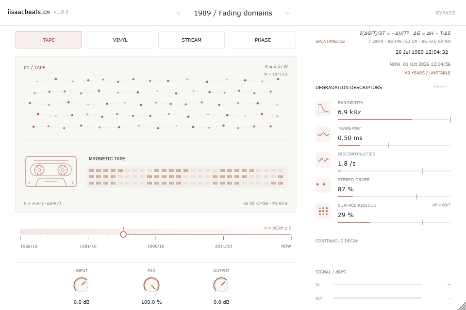
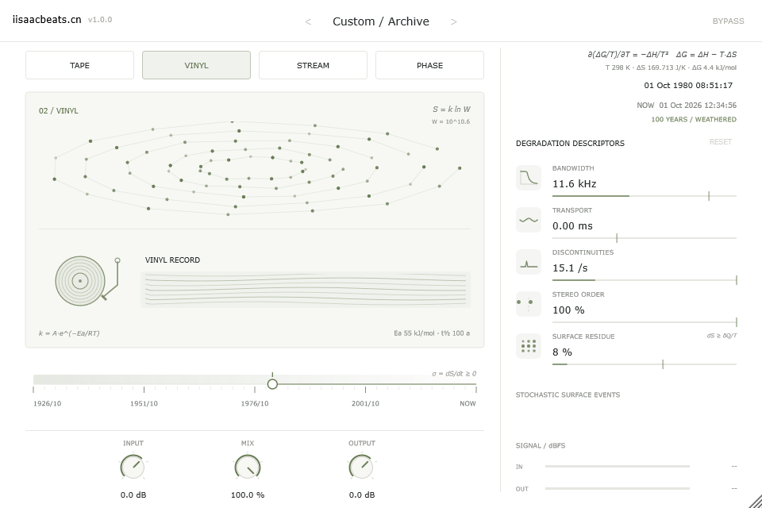

<h1 align="center">Entropy</h1>

<p align="center"><strong>物理化学 · 熵 · 载体的时间之箭</strong></p>

<p align="center">
  <em>Pick a medium, point at a date — hear its disorder.</em>
</p>

<p align="center">
  
  
  
  
</p>

<p align="center">
  <code>TAPE · VINYL · STREAM · PHASE → 时间轴 → 退化 DSP</code><br>
  <code>σ = dS/dt ≥ 0 · ΔG = ΔH − T·ΔS · S = k ln W</code>
</p>

---

## 概述 / Overview

**Entropy** 是理科系列第二款作品，一款以"载体随时间失序"为隐喻的音频退化效果器。主交互是**选择载体 → 在时间轴上选择日期**：日期与本地时钟的距离（时间之箭）被映射为四种介质的退化程度——时间越古老，混乱程度越高。

> **中文**：一款把热力学第二定律"熵随时间增加"做成声音的效果器。界面围绕一条反向日期时间轴展开，用户选择磁带、黑胶、数字流媒体或光盘介质，再把日期拖回过去；日期距离当下的时间被换算为有效熵，驱动高频损失、走带漂移、爆音、丢包、误纠鸟鸣等退化 DSP。界面中融合 Gibbs–Helmholtz、玻尔兹曼、Clausius 与 Arrhenius 公式，实时数值随拖动跳动。
>
> **English**: An audio degradation effect built on the second law of thermodynamics — entropy grows with time. Choose a carrier (magnetic tape, vinyl, digital stream or optical disc), pick a date on the reversed timeline; the distance to the local clock becomes effective entropy and drives band-limits, transport wobble, clicks, packet loss and mis-correction artefacts. Gibbs–Helmholtz, Boltzmann, Clausius and Arrhenius equations are fused into the UI and respond live to the timeline.

> 分类 Category：Effect / Distortion ｜ 插件代码 Plug-in Code：`Entr` ｜ 厂商 Vendor：iisaacbeats.cn

---

## 预览 / Preview

<p align="center">
  
  
</p>

<p align="center">
  <code>左：磁带 · 1989 / Fading domains ░ 右：黑胶 · 1973 / Dust in the groove</code><br>
  <em>left: magnetic tape at 1989 — right: vinyl at 1973.</em>
</p>

---

## 核心概念 / Concept

- **时间轴就是第二定律的 t 轴**：左端更古老、更混乱，右端是现在。日期被绝对保存，工程关闭期间现实时间继续流逝，载体会持续老化。
- **四种载体，四种时间尺度**：TAPE 60 年、VINYL 100 年、STREAM 24 小时（持续传输损伤）、PHASE 40 年。时间尺度是艺术标定，不是介质寿命测量。
- **物理化学公式层**：纯展示、零理解成本——

| 位置 | 公式 | 说明 |
|------|------|------|
| 时间轴右端 | σ = dS/dt ≥ 0 | 熵产生率——第二定律的一句话 |
| 右上角 | ∂(ΔG/T)/∂T = −ΔH/T² 与 ΔG = ΔH − T·ΔS | Gibbs–Helmholtz 签名 + 活公式：T = 298 K 室温锚点，ΔS 来自时间轴，ΔG 在时间轴中点过零并显示 SPONTANEOUS |
| 模型视图 | S = k ln W，W ≈ 10^(23·S) | 玻尔兹曼熵与微观状态计数 |
| 卡片底部 | k = A·e^(−Ea/RT)，Ea / t½ | Arrhenius 速率方程，t½ 恰等于该载体时间尺度 |
| SURFACE 行 | dS ≥ δQ/T | Clausius 不等式：噪声床即注入的热流 |

> 公式中的 ΔH / Ea 为艺术标定常数（`Source/Thermodynamics.h`），T = 298.15 K 是真实室温锚点；它们不是对真实介质的热化学测量。

---

## 功能模块 / Modules

| 模块 / Module | 功能描述 / Description |
|------|---------|
| **载体选择 Carriers** | 磁带 / 黑胶 / 流媒体 / 光盘四种介质，切换带 0.3 s 交叉过渡动画与强调色变换。<br>*Four carriers with animated cross-fade and accent colours.* |
| **日期时间轴 Timeline** | 反向日期轴：左旧右今，41 个标尺刻度与日期标签；拖动、方向键、Home/End 选择；双击或 Enter 弹出 0–100 快捷数值框；右上日期可双击精确编辑。<br>*Reversed date axis with ruler ticks; drag / arrow keys / Home/End; double-click for a 0–100 quick input.* |
| **五行效果条 Module bars** | 每载体 5 行退化（带宽 / 走带 / 断续 / 声场 / 表面残留），按住拖动 0–100% 缩放该行强度，单击切换旁路，RESET 恢复。<br>*Five per-carrier degradation rows; drag to scale intensity, click to bypass.* |
| **退化 DSP Degradation** | 固定约 10 ms 延迟补偿；高频滚降、wow/flutter、饱和、hiss、dropout、黑胶爆音、码率阶梯、预回声 smear、丢包、误纠鸟鸣等，四路常驻运行。<br>*~10 ms latency-compensated; four lanes always run and cross-fade.* |
| **工厂预设 Presets** | 20 个年代介质预设（Fresh stock → Oxide memory / First pressing → Worn to noise / Lossless reference → Buffer exhausted / Crystalline → Amorphous），每个预设拥有独特的五行强度组合。<br>*20 era-based presets with per-row intensity profiles.* |
| **状态与快照 State** | 绝对 UTC 日期、7 个宿主参数、20 个行强度与旁路掩码随工程保存；`.entropypreset` 快照文件；v1/v2 旧状态自动迁移。<br>*Absolute date, host params, per-row intensities and bypass mask persist; legacy snapshots migrate.* |

---

## 技术栈 / Tech Stack

| 项目 / Item | 版本 / Version |
|------|------|
| 语言 Language | C++17 |
| 框架 Framework | [JUCE](https://juce.com) 8.0.12（FetchContent 自动拉取） |
| 构建 Build | CMake ≥ 3.22 |
| 格式 Formats | VST3 / AU / Standalone |
| DSP | 自研四载体退化引擎（无外部音频库依赖） |

---

## 构建 / Build

```bash
# 克隆仓库 Clone
git clone https://github.com/sweetorange1/Entropy.git
cd Entropy
```

### Windows

```powershell
# 一键构建 VST3 + Standalone，并运行全部离线回归
.\build.ps1
```

产物位于 `cmake-build-ninja/Entropy_artefacts/Release/`（`VST3/Entropy.vst3`、`Standalone/Entropy.exe`）。

### macOS

```bash
cmake -B cmake-build-release -DCMAKE_BUILD_TYPE=Release
cmake --build cmake-build-release --config Release
```

产物位于 `cmake-build-release/Entropy_artefacts/Release/`（`VST3/Entropy.vst3`、`AU/Entropy.component`）。

### 离线测试 / Offline tests

- `EntropyDSPTests`：延迟对齐、四载体可听性、分块一致性、自动化压力、无实时分配、行强度语义。
- `EntropyStateTests`：状态往返与 v1/v2 迁移、日期解析、预设识别、UI 手势与多缩放渲染。

---

## 打包 / Packaging

### Windows（Inno Setup）

```bat
# 需先完成 Release 构建，再运行：
build_installer.bat
```

输出 `dist\Entropy_Setup_1.0.0_x64.exe`，安装到 `C:\Program Files\Common Files\VST3\iisaacbeats.cn`。

### macOS（pkg + dmg）

```bash
chmod +x build_installer_mac.sh
./build_installer_mac.sh              # 打包 pkg + dmg（未签名）
./build_installer_mac.sh --no-dmg     # 只打 pkg
./build_installer_mac.sh --sign "Developer ID Application: ..."  # 签名后打包
```

输出 `dist\Entropy_Setup_<ver>_macOS.pkg / .dmg`。

---

## 许可 / License

[GPL-3.0](LICENSE)

---

## 关于 / About

- 厂商 Vendor：[iisaacbeats.cn](https://iisaacbeats.cn)
- 系列 Series：理科系列 02 —— 前作 *Organic Chemistry*（有机化学合成器），本作以物理化学的熵为主题。
- 本项目界面视觉与交互延续 *Organic Chemistry* 的浅色实验室风格。
